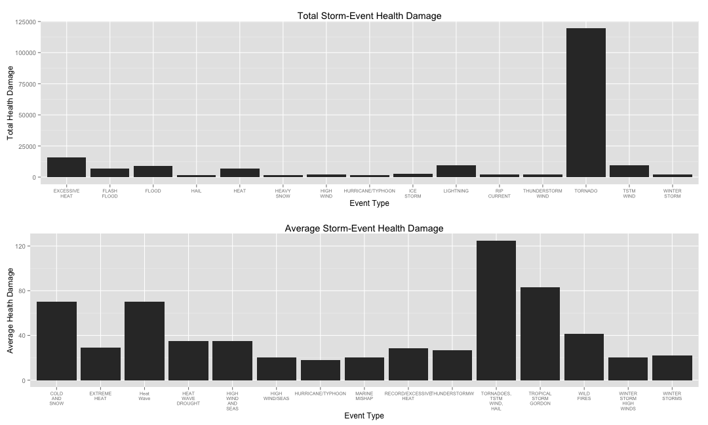
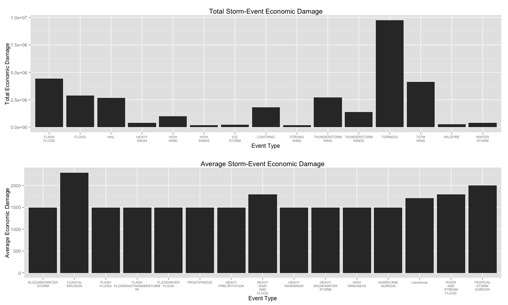
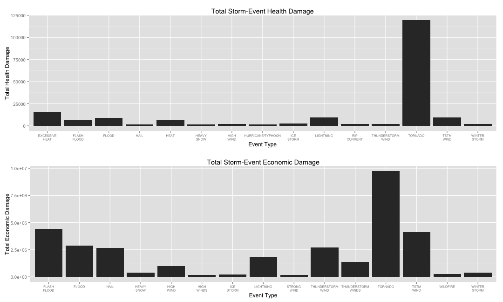

Insights from NOAA Storm Data (c. January 1950 - November 2011)
========================================================
## Synopsis 

This project involves exploring the U.S. National Oceanic and Atmospheric Administration's (NOAA) storm database. This database tracks characteristics of major storms and weather events in the United States, including when and where they occur, as well as estimates of any fatalities, injuries, and property damage.

The events in the database start in the year 1950 and end in November 2011. In the earlier years of the database there are generally fewer events recorded, most likely due to a lack of good records. More recent years should be considered more complete.

We'll start, of course, by loading the data into our R session...

## Data Processing

The data for this assignment comes in the form of a comma-separated-value file compressed via the bzip2 algorithm to reduce its size. It can be downloaded here: https://d396qusza40orc.cloudfront.net/repdata%2Fdata%2FStormData.csv.bz2

There is also some documentation of the database available. Here you will find how some of the variables are constructed/defined.

National Weather Service Storm Data Documentation: https://d396qusza40orc.cloudfront.net/repdata%2Fpeer2_doc%2Fpd01016005curr.pdf

National Climatic Data Center Storm Events FAQ: https://d396qusza40orc.cloudfront.net/repdata%2Fpeer2_doc%2FNCDC%20Storm%20Events-FAQ%20Page.pdf

The following is our process for downloading the zip file from its URL, and then using R's unzip() and readCSV() methods to load the data frame into our environment. 


```r

if (!file.exists("./data")) {
    dir.create("./data")
}

fileUrl = "https://d396qusza40orc.cloudfront.net/repdata%2Fdata%2FStormData.csv.bz2"
download.file(fileUrl, destfile = "./data/StormData", method = "curl")

NWS = read.csv("./data/StormData")
```


##Objective:
The basic goal of this assignment is to explore the NOAA Storm Database and answer some basic questions about severe weather events. The database will be used to answer the questions below and code will be shown for the entire analysis. Your analysis will consist of tables, figures, or other summaries, and it may employ any number of R pacakages.


## Question 1


Across the United States, which types of events (as indicated in the EVTYPE variable) are most harmful with respect to population health?

### Results

To answer this, we first need to devise a metric that properly relfects a harmful impact on 
population health. We'll then group up events by their specific type, and compute the metric
on each intance of an event within each type. 

Let's see what variables we're working with:

```r
names(NWS)
```

```
##  [1] "STATE__"    "BGN_DATE"   "BGN_TIME"   "TIME_ZONE"  "COUNTY"    
##  [6] "COUNTYNAME" "STATE"      "EVTYPE"     "BGN_RANGE"  "BGN_AZI"   
## [11] "BGN_LOCATI" "END_DATE"   "END_TIME"   "COUNTY_END" "COUNTYENDN"
## [16] "END_RANGE"  "END_AZI"    "END_LOCATI" "LENGTH"     "WIDTH"     
## [21] "F"          "MAG"        "FATALITIES" "INJURIES"   "PROPDMG"   
## [26] "PROPDMGEXP" "CROPDMG"    "CROPDMGEXP" "WFO"        "STATEOFFIC"
## [31] "ZONENAMES"  "LATITUDE"   "LONGITUDE"  "LATITUDE_E" "LONGITUDE_"
## [36] "REMARKS"    "REFNUM"
```


Two variables in particular stand out that can be used to gauge a direct impact on population
health: "FATALITIES" and "INJURIES". 

Vis a vis, I've chosen to take each event's number of injuries as is and weight its number of fatilities by 5. (Clearly, though, an extreme amount of ambiguity exisits in such a weighted interpretation, and the metric would certainly lend itself to further refinement if more detailed data on healh effects were present.)


```r

# Isolate the data for each event's 'EVTYPE' and factor in our new
# 'health_damage' metric

df = data.frame(event_type = NWS$EVTYPE, health_damage = (NWS$INJURIES + (5 * 
    NWS$FATALITIES)))


# Group and aggreagte the events and their health_damage value
total_harm_by_event = tapply(df$health_damage, df$event_type, "sum")
avg_harm_by_event = tapply(df$health_damage, df$event_type, "mean")


# Sort the values in descending order and display the top 15
total_harm_by_event = sort(total_harm_by_event, decreasing = T)
head(total_harm_by_event, 15)
```

```
##           TORNADO    EXCESSIVE HEAT         TSTM WIND         LIGHTNING 
##            119511             16040              9477              9310 
##             FLOOD              HEAT       FLASH FLOOD         ICE STORM 
##              9139              6785              6667              2420 
##         HIGH WIND      WINTER STORM THUNDERSTORM WIND       RIP CURRENT 
##              2377              2351              2153              2072 
##        HEAVY SNOW HURRICANE/TYPHOON              HAIL 
##              1656              1595              1436
```

```r

avg_harm_by_event = sort(avg_harm_by_event, decreasing = T)
head(avg_harm_by_event, 15)
```

```
## TORNADOES, TSTM WIND, HAIL      TROPICAL STORM GORDON 
##                     125.00                      83.00 
##              COLD AND SNOW                  Heat Wave 
##                      70.00                      70.00 
##                 WILD FIRES          HEAT WAVE DROUGHT 
##                      41.25                      35.00 
##         HIGH WIND AND SEAS               EXTREME HEAT 
##                      35.00                      28.86 
##      RECORD/EXCESSIVE HEAT              THUNDERSTORMW 
##                      28.33                      27.00 
##              WINTER STORMS             HIGH WIND/SEAS 
##                      22.33                      20.00 
##              MARINE MISHAP    WINTER STORM HIGH WINDS 
##                      20.00                      20.00 
##          HURRICANE/TYPHOON 
##                      18.12
```

```r

```


This approach shows that tornadoes are the far-and-away leader the in terms of their effect on the health damage metric. One crucial distinction is health damage readings we get when we sum the metric for each event, compared to when we normalize it over the event counts. 

Tornadoes are still the top groupnig in both statistics, but certain groups such as "HIGH WIND AND SEAS", "MARINE MISHAP", and "COLD AND SNOW" are ordered much differently when we average. 

(And certain groups, like "TROPICAL STORM GORDON" show how this analysis could be extended by factoring out event types with a single or highly infrequent occurance).


Digging further, it might also help to compute a few summary statistics for our values, as well as visualize them with a paneled barplot


```r
summary(total_harm_by_event)
```

```
##    Min. 1st Qu.  Median    Mean 3rd Qu.    Max. 
##       0       0       0     220       0  120000
```

```r
mean(total_harm_by_event)
```

```
## [1] 219.5
```

```r

summary(avg_harm_by_event)
```

```
##    Min. 1st Qu.  Median    Mean 3rd Qu.    Max. 
##    0.00    0.00    0.00    1.19    0.00  125.00
```

```r
mean(avg_harm_by_event)
```

```
## [1] 1.192
```

```r


plot_df1 = data.frame(event_type = names(head(total_harm_by_event, 15)), health_damage = head(total_harm_by_event, 
    15))

# Give the event names line breaks so they can be better formatted into our
# plot
levels(plot_df1$event_type) <- gsub(" ", "\n", levels(plot_df1$event_type))

# install.packages('ggplot2')
library(ggplot2)

total_health_plot = ggplot(data = plot_df1, aes(y = health_damage, x = event_type)) + 
    geom_bar(stat = "identity") + ylab("Total Health Damage") + xlab("Event Type") + 
    theme(axis.text.x = element_text(size = 7)) + ggtitle("Total Storm-Event Health Damage")


plot_df2 = data.frame(event_type = names(head(avg_harm_by_event, 15)), health_damage = head(avg_harm_by_event, 
    15))

# Give the event names line breaks so they can be better formatted into our
# plot
levels(plot_df2$event_type) <- gsub(" ", "\n", levels(plot_df2$event_type))


avg_health_plot = ggplot(data = plot_df2, aes(y = health_damage, x = event_type)) + 
    geom_bar(stat = "identity") + ylab("Average Health Damage") + xlab("Event Type") + 
    theme(axis.text.x = element_text(size = 7)) + ggtitle("Average Storm-Event Health Damage")


# Using the grid extra library, we can extend our two ggplots to a paneled
# display mode install.packages('gridExtra')
library(gridExtra)
```

```
## Loading required package: grid
```

```r
grid.arrange(total_health_plot, avg_health_plot, ncol = 1)
```

 


## Question 2

Across the United States, which types of events have the greatest economic consequences?

### Results

This question lends itself to the same methods that we used for question one, although now we need to consider a different set of variables to create our metric. 


```r
names(NWS)
```

```
##  [1] "STATE__"    "BGN_DATE"   "BGN_TIME"   "TIME_ZONE"  "COUNTY"    
##  [6] "COUNTYNAME" "STATE"      "EVTYPE"     "BGN_RANGE"  "BGN_AZI"   
## [11] "BGN_LOCATI" "END_DATE"   "END_TIME"   "COUNTY_END" "COUNTYENDN"
## [16] "END_RANGE"  "END_AZI"    "END_LOCATI" "LENGTH"     "WIDTH"     
## [21] "F"          "MAG"        "FATALITIES" "INJURIES"   "PROPDMG"   
## [26] "PROPDMGEXP" "CROPDMG"    "CROPDMGEXP" "WFO"        "STATEOFFIC"
## [31] "ZONENAMES"  "LATITUDE"   "LONGITUDE"  "LATITUDE_E" "LONGITUDE_"
## [36] "REMARKS"    "REFNUM"
```


"PROPDMG" and "CROPDMG" and appear to be our key indicators. (Their companion variables, "PROPDMGEXP" and "CROPDMGEXP", are codes for the units used in measuring the expense. They appear to be consistent between the two "PROPDMG" and "CROPDMG" amounts within each row, however, and thus inconsequential in the weighting).

I chose to take "CROPDMG" at face and weight "PROPDMG" by 3. The reason being that while both numbers reflect an estimate of initial monetary damage, property damage has a much higher recoup cost in the future that needs to be considered for our economic scope. 

Broadly speaking, crops have a lifecycle that's already consistent with seasonal regrowth -- regardless of whether or not they were destroyed by a weather event in the past. Property, meanwhile, carries a more permanant expectation, and requires a much more costly undertaking to rebuild. 


```r

# Compute our metric for every event instance and pair it up with the event
df2 = data.frame(event_type = NWS$EVTYPE, economic_damage = (NWS$CROPDMG + (3 * 
    NWS$PROPDMG)))


# Group and aggreagte the events and their health_damage value
total_economic_damage_grouped = tapply(df2$economic_damage, df2$event_type, 
    "sum")
avg_economic_damage_grouped = tapply(df2$economic_damage, df2$event_type, "mean")

# Sort groups by damage, in descending order, and display the top 25
total_economic_damage_grouped = sort(total_economic_damage_grouped, decreasing = T)
head(total_economic_damage_grouped, 15)
```

```
##            TORNADO        FLASH FLOOD          TSTM WIND 
##            9736793            4439574            4117099 
##              FLOOD  THUNDERSTORM WIND               HAIL 
##            2867853            2697324            2645676 
##          LIGHTNING THUNDERSTORM WINDS          HIGH WIND 
##            1813636            1357564             991478 
##       WINTER STORM         HEAVY SNOW           WILDFIRE 
##             400141             368922             257742 
##          ICE STORM        STRONG WIND         HIGH WINDS 
##             199691             190598             168635
```

```r

avg_economic_damage_grouped = sort(avg_economic_damage_grouped, decreasing = T)
head(avg_economic_damage_grouped, 15)
```

```
##                COASTAL EROSION          TROPICAL STORM GORDON 
##                           2298                           2000 
##           HEAVY RAIN AND FLOOD         RIVER AND STREAM FLOOD 
##                           1800                           1800 
##                      Landslump          BLIZZARD/WINTER STORM 
##                           1710                           1500 
##                   FLASH FLOOD/ FLASH FLOODING/THUNDERSTORM WI 
##                           1500                           1500 
##              FLOOD/RIVER FLOOD                  FROST\\FREEZE 
##                           1500                           1500 
##            HEAVY PRECIPITATION                HEAVY RAIN/SNOW 
##                           1500                           1500 
##        HEAVY SNOW/WINTER STORM                 HIGH WIND/SEAS 
##                           1500                           1500 
##               HURRICANE GORDON 
##                           1500
```


Again, we see some insightful distinctions between the total economic damage incurred by each type of event and the avarage (albeit with the average begging to be refined to eliminate one-shots). 

Tornadoes lead the way in both summaries, with flooding making itself prominent as well. Hail and wildfires, however, are present in the total measurement but absent in the average. 

It's also interesting to see how the "economic" context completely removes events such as "MARINE MISHAP", "ROUGH SEAS", and "HEAT_WAVE" from the top 25 averages. Weather events that are incredibly life-threatening and fatal don't always correlate to weather events that threaten the economy... and vice versa.  


```r

summary(total_economic_damage_grouped)
```

```
##    Min. 1st Qu.  Median    Mean 3rd Qu.    Max. 
##       0       0       0   34500     142 9740000
```

```r
mean(total_economic_damage_grouped)
```

```
## [1] 34550
```

```r

summary(avg_economic_damage_grouped)
```

```
##    Min. 1st Qu.  Median    Mean 3rd Qu.    Max. 
##     0.0     0.0     0.0    71.4    20.9  2300.0
```

```r
mean(avg_economic_damage_grouped)
```

```
## [1] 71.38
```

```r


plot_df3 = data.frame(event_type = names(head(total_economic_damage_grouped, 
    15)), health_damage = head(total_economic_damage_grouped, 15))


# Give the event names line breaks so they can be better formatted into our
# plot
levels(plot_df3$event_type) <- gsub(" ", "\n", levels(plot_df3$event_type))

total_econ_plot = ggplot(data = plot_df3, aes(y = health_damage, x = event_type)) + 
    geom_bar(stat = "identity") + ylab("Total Economic Damage") + xlab("Event Type") + 
    theme(axis.text.x = element_text(size = 7)) + ggtitle("Total Storm-Event Economic Damage")


plot_df4 = data.frame(event_type = names(head(avg_economic_damage_grouped, 15)), 
    health_damage = head(avg_economic_damage_grouped, 15))

# Give the event names line breaks so they can be better formatted into our
# plot
levels(plot_df4$event_type) <- gsub(" ", "\n", levels(plot_df4$event_type))


avg_econ_plot = ggplot(data = plot_df4, aes(y = health_damage, x = event_type)) + 
    geom_bar(stat = "identity") + ylab("Average Economic Damage") + xlab("Event Type") + 
    theme(axis.text.x = element_text(size = 7)) + ggtitle("Average Storm-Event Economic Damage")


grid.arrange(total_econ_plot, avg_econ_plot, ncol = 1)
```

 


Finally, for a quick glance at the top 15 impactors on total health damage vs the top 15 impactors on total economic damage, we can use the same gridExtra plotting method on the plots from both questions.


```r
grid.arrange(total_health_plot, total_econ_plot, ncol = 1)
```

 


